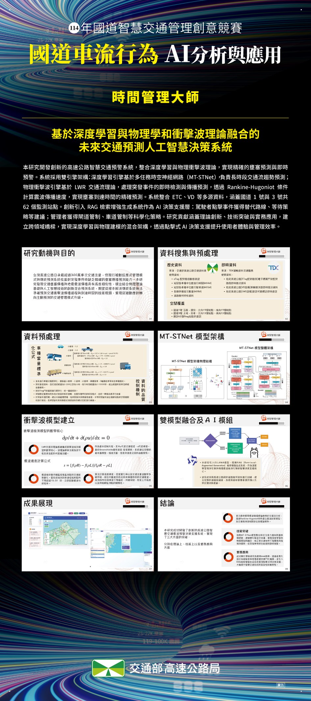

<p align="center">
  
</p>

<h1 align="center">Highway Intelligent Traffic Shockwave Warning System</h1>

<p align="center">
  <strong>AI Decision System for Future Traffic Prediction — Based on Deep Learning Fusion with Physics and Shockwave Theory</strong>
</p>

<p align="center">
  <a href="https://highway-trafficwave-p3mo2f2qh-tim-weis-projects-a5ce8b80.vercel.app"></a>
  <a href="https://opensource.org/licenses/MIT"></a>
  <a href="https://www.python.org/downloads/"></a>
  <a href="https://fastapi.tiangolo.com/"></a>
  <a href="https://nextjs.org/"></a>
  <a href="https://www.typescriptlang.org/"></a>
  <a href="https://tensorflow.org/"></a>
  <a href="https://doi.org/10.1109/TITS.2024.3411638"></a>
  
  
</p>

<p align="center">
  <a href="README.md">English</a> | <a href="README_ZH.md">中文</a>
</p>

---

## Demo

<p align="center">
  
</p>

> Real-time demonstration of the traffic shockwave warning system in action

---

## Overview

<table>
<tr>
<td width="60%">

Taiwan's highways handle over **3 million vehicle trips daily**. Traditional passive traffic management struggles with sudden congestion events.

This research discovers that **traffic congestion propagation shares striking similarities with seismic wave propagation**, leading to an innovative hybrid prediction system that combines:

- **Physics-Based Detection**: Rankine-Hugoniot kinematic wave theory
- **Deep Learning Prediction**: MT-SWNet with graph neural networks
- **RAG-Enhanced AI**: Intelligent decision support system

</td>
<td width="40%">


</td>
</tr>
</table>

---

## 🏆 Awards & Recognition

| Achievement | Event | Date |
|-------------|-------|------|
| 🥈 **2nd Place** (1st Place Vacant) | National Expressway Intelligent Traffic Competition | Oct 2024 |
| 🎤 **Invited Speaker** | 2025 Chinese Institute of Transportation Annual Conference | Dec 2025 |

> This project was presented at the 2025 Annual Meeting of the Chinese Institute of Transportation, sharing our innovative approach of combining deep learning with physics-based shockwave theory for highway traffic prediction.

### Competition Showcase

<table>
<tr>
<td width="33%">
<p align="center">
  
</p>
<p align="center"><sub>Official Competition Poster</sub></p>
</td>
<td width="33%">
<p align="center">
  
</p>
<p align="center"><sub>2025 CIT Annual Conference</sub></p>
</td>
<td width="33%">
<p align="center">
  
</p>
<p align="center"><sub>Conference Presentation</sub></p>
</td>
</tr>
</table>

---

## Key Features

| | | | |
|:---:|:---:|:---:|:---:|
| **Real-Time Monitoring** | **Shockwave Detection** | **AI Prediction** | **Smart Routing** |
| 62 ETC stations across Taiwan | Sub-5 second alert latency | 10-60 min advance forecast | Dynamic route optimization |

### Shockwave Severity Levels

| Level | Speed Drop | Visual | Action |
|:-----:|:----------:|:------:|:-------|
| 🟢 **Mild** | 10-20 km/h | Green | Minor delays expected |
| 🟡 **Moderate** | 20-30 km/h | Yellow | Consider alternative routes |
| 🔴 **Severe** | 30+ km/h | Red | Route change recommended |

---

## System Screenshots

### Driver Interface

<p align="center">
  
</p>

<details>
<summary><b>Features Highlight</b></summary>

- Interactive traffic map with real-time congestion status
- Shockwave radar visualization with propagation animation
- AI-powered route suggestions
- Personalized departure time recommendations

</details>

### Admin Control Center

<p align="center">
  
</p>

<details>
<summary><b>Features Highlight</b></summary>

- Network-wide traffic monitoring
- MT-SWNet prediction visualization (90% confidence)
- AI decision support recommendations
- Historical trend analysis

</details>

---

## Architecture

```
┌─────────────────────────────────────────────────────────────────┐
│                        Frontend Layer                           │
│  ┌─────────────┐  ┌─────────────┐  ┌─────────────────────────┐ │
│  │   Driver    │  │    Admin    │  │     Real-time Map       │ │
│  │  Dashboard  │  │   Control   │  │   (React + Leaflet)     │ │
│  └─────────────┘  └─────────────┘  └─────────────────────────┘ │
└───────────────────────────┬─────────────────────────────────────┘
                            │ WebSocket / REST API
┌───────────────────────────┼─────────────────────────────────────┐
│                      Backend Layer                              │
│  ┌──────────────────────────────────────────────────────────┐  │
│  │              FastAPI Server (Port 8000)                  │  │
│  │  • /api/traffic    • /api/shockwave   • /api/prediction  │  │
│  │  • /api/location   • /api/rag         • /api/admin       │  │
│  └──────────────────────────────────────────────────────────┘  │
│                                                                 │
│  ┌────────────────┐  ┌────────────────┐  ┌────────────────┐   │
│  │   MT-SWNet     │  │   Shockwave    │  │   RAG AI       │   │
│  │   Predictor    │  │   Detector     │  │   Assistant    │   │
│  │  (TensorFlow)  │  │ (LWR Physics)  │  │   (Ollama)     │   │
│  └────────────────┘  └────────────────┘  └────────────────┘   │
└───────────────────────────┬─────────────────────────────────────┘
                            │
┌───────────────────────────┼─────────────────────────────────────┐
│                      Data Layer                                 │
│  ┌────────────┐  ┌────────────┐  ┌────────────────────────┐   │
│  │  TDX API   │  │  TISC API  │  │   SQLite + Graph Data  │   │
│  │ (Real-time)│  │ (Real-time)│  │    (62×62 Adjacency)   │   │
│  └────────────┘  └────────────┘  └────────────────────────┘   │
└─────────────────────────────────────────────────────────────────┘
```

---

## MT-SWNet Model

<table>
<tr>
<td width="50%">

### Model Architecture

The **Multi-Task ShockWave Network** features:

- **Encoder**: Dual ST-Physical Blocks with spatial attention, temporal attention, and multi-head GCN
- **Decoder**: Masked ST-Physical Block with generative inference
- **Multi-task Output**: Simultaneous flow, speed, and density prediction

**Key Innovation**: Graph structure embedding with degree, edge, and distance matrices for capturing road network topology.

</td>
<td width="50%">


</td>
</tr>
</table>

### Performance Comparison

| Model | MAE (veh/5min) | RMSE | MAPE (%) | R² |
|:------|:--------------:|:----:|:--------:|:--:|
| **MT-SWNet** | **12.3** | **18.7** | **8.5** | **0.912** |
| Graph-WaveNet | 13.2 | 19.8 | 8.9 | 0.903 |
| AGCRN | 13.8 | 21.2 | 9.3 | 0.895 |
| DCRNN | 14.5 | 22.1 | 9.8 | 0.887 |
| LSTM | 18.9 | 28.7 | 13.5 | 0.798 |
| ARIMA | 21.3 | 32.1 | 15.7 | 0.721 |

---

## Shockwave Detection Theory

<table>
<tr>
<td width="50%">

### LWR Traffic Flow Model

Based on the **Lighthill-Whitham-Richards** continuity equation:

$$\frac{\partial \rho}{\partial t} + \frac{\partial (\rho u)}{\partial x} = 0$$

Where:
- ρ = traffic density
- u = vehicle speed

### Rankine-Hugoniot Condition

Shockwave propagation speed:

$$s = \frac{f(\rho_R) - f(\rho_L)}{\rho_R - \rho_L}$$

</td>
<td width="50%">


</td>
</tr>
</table>

---

## Data Sources & Processing

<table>
<tr>
<td width="50%">

### Data Sources


**Historical Data** from TISC (Taiwan Highway Traffic Database):
- eTag paired path dynamic information
- Median travel time by vehicle type (M04A)
- Median travel speed by vehicle type (M05A)
- Trip counts by vehicle type (M08A)

**Real-time Data** from TDX Platform:
- ETC gantry paired section traffic
- VD vehicle detector real-time data
- CMS variable message sign information

</td>
<td width="50%">

### Data Quality Control


### Vehicle PCU Standardization


</td>
</tr>
</table>

---

## Quick Start

### Prerequisites

- Python 3.11+
- Node.js 18.0+
- TDX API credentials ([Apply here](https://tdx.transportdata.tw/))
- Google Maps API key ([Get here](https://console.cloud.google.com/))

### Installation

```bash
# Clone repository
git clone https://github.com/timwei0801/Highway_trafficwave.git
cd Highway_trafficwave

# Backend setup
python -m venv venv
source venv/bin/activate  # Windows: venv\Scripts\activate
pip install -r requirements.txt

# Frontend setup
cd frontend && npm install && cd ..

# Configure environment
cp .env.example .env
# Edit .env with your API credentials
```

### Run

```bash
# Option 1: One-command deployment
./deploy.sh

# Option 2: Manual startup
# Terminal 1 - Backend
cd api && python main.py

# Terminal 2 - Frontend
cd frontend && npm run dev
```

### Access Points

| Interface | URL | Description |
|:----------|:----|:------------|
| 🚗 Driver Dashboard | http://localhost:3000/driver | Navigation & alerts |
| 🎛️ Admin Control | http://localhost:3000/admin | System management |
| 📚 API Docs | http://localhost:8000/docs | Swagger UI |

---

## API Examples

<details>
<summary><b>Get Active Shockwaves</b></summary>

```python
import requests

response = requests.get('http://localhost:8000/api/shockwave/active')
shockwaves = response.json()

for sw in shockwaves['active_shockwaves']:
    print(f"Severity: {sw['severity']}, Speed Drop: {sw['speed_drop']} km/h")
```

</details>

<details>
<summary><b>Traffic Prediction</b></summary>

```python
payload = {
    "station_ids": ["01F0340N", "01F0360N"],
    "prediction_steps": 12  # 60 minutes
}

response = requests.post('http://localhost:8000/api/prediction/traffic', json=payload)
predictions = response.json()
```

</details>

<details>
<summary><b>AI Assistant Query</b></summary>

```python
payload = {
    "query": "Best time to travel from Taipei to Hsinchu?",
    "context": {"origin": "Taipei", "destination": "Hsinchu"}
}

response = requests.post('http://localhost:8000/api/rag/chat', json=payload)
print(response.json()['response'])
```

</details>

---

## Performance

<table>
<tr>
<td width="33%" align="center">
<h3>87%</h3>
<sub>Shockwave Detection Accuracy</sub>
</td>
<td width="33%" align="center">
<h3>&lt;5s</h3>
<sub>Detection Latency</sub>
</td>
<td width="33%" align="center">
<h3>90%</h3>
<sub>Prediction Confidence</sub>
</td>
</tr>
</table>

---

## Citation

```bibtex
@article{zou2024mtstnet,
  title={MT-STNet: A Novel Multi Task Spatiotemporal Network for Highway Traffic Flow Prediction},
  author={Zou, Guojian and others},
  journal={IEEE Transactions on Intelligent Transportation Systems},
  year={2024},
  doi={10.1109/TITS.2024.3411638}
}

@software{highway_shockwave_system,
  title={Highway Intelligent Traffic Shockwave Warning System},
  author={Wei, Tim},
  year={2024},
  url={https://github.com/timwei0801/Highway_trafficwave}
}
```

> **Note**: MT-SWNet is our team's enhanced version based on the original MT-STNet architecture.

---

## License

This project is licensed under the MIT License - see [LICENSE](LICENSE) for details.

---

## Acknowledgments

- **MT-STNet Research Team** - Original deep learning model architecture
- **Taiwan Ministry of Transportation** - TDX Open Data Platform
- **TensorFlow, FastAPI, Next.js** - Open source frameworks

---

<p align="center">
  <a href="https://github.com/timwei0801/Highway_trafficwave">
    
  </a>
  <a href="https://github.com/timwei0801/Highway_trafficwave/fork">
    
  </a>
</p>

<p align="center">
  <sub>AI-Powered Traffic Safety Based on Cutting-Edge Scientific Research</sub>
</p>
