<p align="center">
  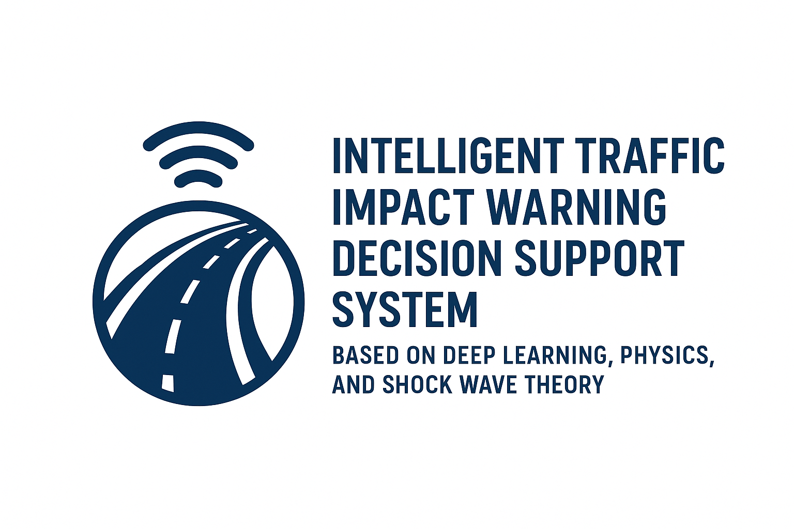
</p>

<h1 align="center">高速公路智慧交通衝擊波預警決策支援系統</h1>

<p align="center">
  <strong>基於深度學習與物理學和衝擊波理論融合的未來交通預測人工智慧決策系統</strong>
</p>

<p align="center">
  <a href="https://highway-trafficwave-p3mo2f2qh-tim-weis-projects-a5ce8b80.vercel.app"></a>
  <a href="https://opensource.org/licenses/MIT"></a>
  <a href="https://www.python.org/downloads/"></a>
  <a href="https://fastapi.tiangolo.com/"></a>
  <a href="https://nextjs.org/"></a>
  <a href="https://www.typescriptlang.org/"></a>
  <a href="https://tensorflow.org/"></a>
  <a href="https://doi.org/10.1109/TITS.2024.3411638"></a>
</p>

<p align="center">
  <a href="README.md">English</a> | <a href="README_ZH.md">中文</a>
</p>

---

## 系統展示

<p align="center">
  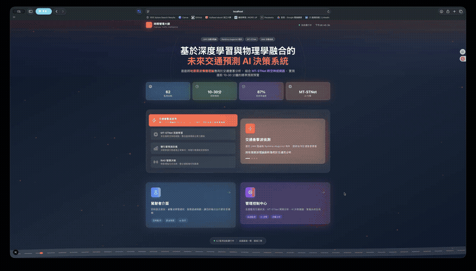
</p>

> 交通衝擊波預警系統的即時操作示範

---

## 研究概述

<table>
<tr>
<td width="60%">

台灣高速公路日承載超過 **300 萬車次交通流量**，但現行被動反應式管理模式與傳統預測系統在面對突發事件時缺乏精確的壅塞傳播預測能力。

本研究發現 **交通壅塞傳播與地震震波傳播具有高度相似性**，提出結合物理理論基礎與人工智慧技術的創新混合預測系統：

- **基於物理的檢測**：Rankine-Hugoniot 運動波理論
- **深度學習預測**：MT-SWNet 圖神經網路
- **RAG 增強 AI**：智慧決策支援系統

</td>
<td width="40%">

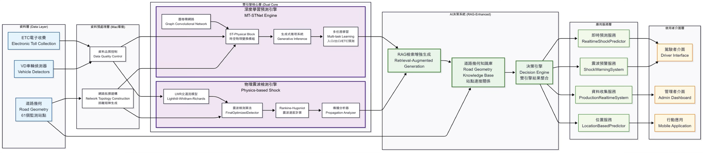

</td>
</tr>
</table>

---

## 核心功能

| | | | |
|:---:|:---:|:---:|:---:|
| **即時交通監控** | **衝擊波預警系統** | **AI 預測分析** | **智慧路線規劃** |
| 全台 62 個 ETC 站點 | 5 秒內即時警報 | 10-60 分鐘提前預測 | 動態路線最佳化 |

### 衝擊波嚴重度分級

| 等級 | 速度下降 | 顏色 | 建議行動 |
|:----:|:-------:|:----:|:---------|
| 🟢 **輕微** | 10-20 km/h | 綠色 | 預期輕微延誤 |
| 🟡 **中等** | 20-30 km/h | 黃色 | 考慮替代路線 |
| 🔴 **嚴重** | 30+ km/h | 紅色 | 建議變更路線 |

---

## 系統截圖

### 駕駛者介面

<p align="center">
  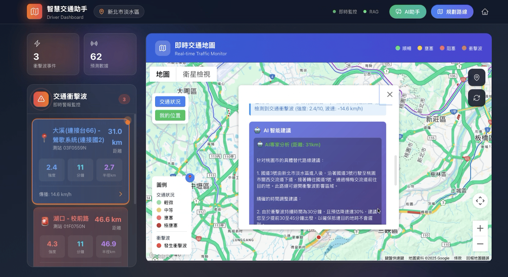
</p>

<details>
<summary><b>功能亮點</b></summary>

- 互動式交通地圖，即時顯示壅塞狀態
- 衝擊波雷達視覺化與傳播動畫
- AI 智慧路線建議
- 個人化出發時間推薦

</details>

### 管理者控制中心

<p align="center">
  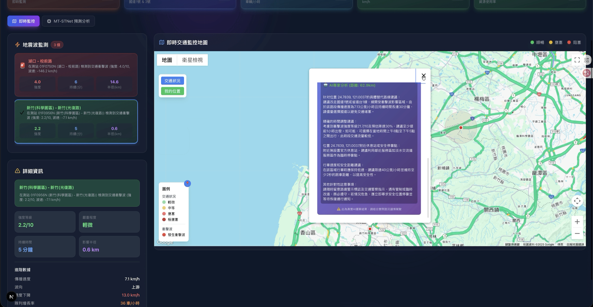
</p>

<details>
<summary><b>功能亮點</b></summary>

- 全路網交通狀態監控
- MT-SWNet 預測視覺化（90% 信心度）
- AI 決策支援建議
- 歷史趨勢分析

</details>

---

## 系統架構

```
┌─────────────────────────────────────────────────────────────────┐
│                          前端層                                  │
│  ┌─────────────┐  ┌─────────────┐  ┌─────────────────────────┐ │
│  │   駕駛者    │  │    管理者    │  │      即時地圖           │ │
│  │   儀表板    │  │   控制中心   │  │   (React + Leaflet)     │ │
│  └─────────────┘  └─────────────┘  └─────────────────────────┘ │
└───────────────────────────┬─────────────────────────────────────┘
                            │ WebSocket / REST API
┌───────────────────────────┼─────────────────────────────────────┐
│                          後端層                                  │
│  ┌──────────────────────────────────────────────────────────┐  │
│  │              FastAPI 伺服器 (埠 8000)                    │  │
│  │  • /api/traffic    • /api/shockwave   • /api/prediction  │  │
│  │  • /api/location   • /api/rag         • /api/admin       │  │
│  └──────────────────────────────────────────────────────────┘  │
│                                                                 │
│  ┌────────────────┐  ┌────────────────┐  ┌────────────────┐   │
│  │   MT-SWNet     │  │    衝擊波      │  │   RAG AI       │   │
│  │    預測器      │  │    檢測器      │  │    助理        │   │
│  │  (TensorFlow)  │  │  (LWR 物理)    │  │   (Ollama)     │   │
│  └────────────────┘  └────────────────┘  └────────────────┘   │
└───────────────────────────┬─────────────────────────────────────┘
                            │
┌───────────────────────────┼─────────────────────────────────────┐
│                         資料層                                   │
│  ┌────────────┐  ┌────────────┐  ┌────────────────────────┐   │
│  │  TDX API   │  │  TISC API  │  │   SQLite + 圖結構資料   │   │
│  │  (即時)    │  │   (即時)   │  │   (62×62 鄰接矩陣)     │   │
│  └────────────┘  └────────────┘  └────────────────────────┘   │
└─────────────────────────────────────────────────────────────────┘
```

---

## MT-SWNet 模型

<table>
<tr>
<td width="50%">

### 模型架構

**多任務衝擊波網路 (Multi-Task ShockWave Network)** 特色：

- **編碼器**：雙層 ST-Physical Block，整合空間注意力、時間注意力與多頭圖卷積網路
- **解碼器**：Masked ST-Physical Block 搭配生成式推理
- **多任務輸出**：同時預測流量、速度與密度

**核心創新**：透過出度、入度、邊與距離矩陣的圖結構嵌入，捕捉道路網路拓撲關係。

</td>
<td width="50%">

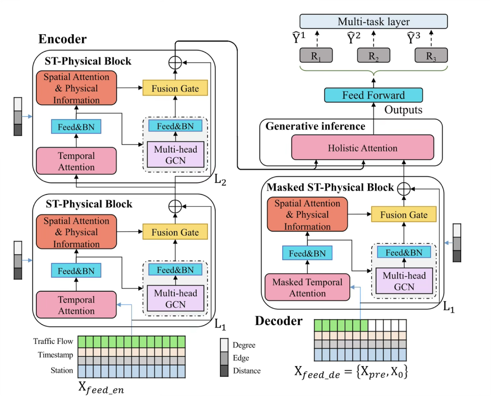

</td>
</tr>
</table>

### 模型性能比較

| 模型 | MAE (車輛/5分) | RMSE | MAPE (%) | R² |
|:-----|:-------------:|:----:|:--------:|:--:|
| **MT-SWNet** | **12.3** | **18.7** | **8.5** | **0.912** |
| Graph-WaveNet | 13.2 | 19.8 | 8.9 | 0.903 |
| AGCRN | 13.8 | 21.2 | 9.3 | 0.895 |
| DCRNN | 14.5 | 22.1 | 9.8 | 0.887 |
| LSTM | 18.9 | 28.7 | 13.5 | 0.798 |
| ARIMA | 21.3 | 32.1 | 15.7 | 0.721 |

---

## 衝擊波檢測理論

<table>
<tr>
<td width="50%">

### LWR 交通流模型

基於 **Lighthill-Whitham-Richards** 連續方程式：

$$\frac{\partial \rho}{\partial t} + \frac{\partial (\rho u)}{\partial x} = 0$$

其中：
- ρ = 交通密度
- u = 車速

### Rankine-Hugoniot 條件

衝擊波傳播速度：

$$s = \frac{f(\rho_R) - f(\rho_L)}{\rho_R - \rho_L}$$

</td>
<td width="50%">

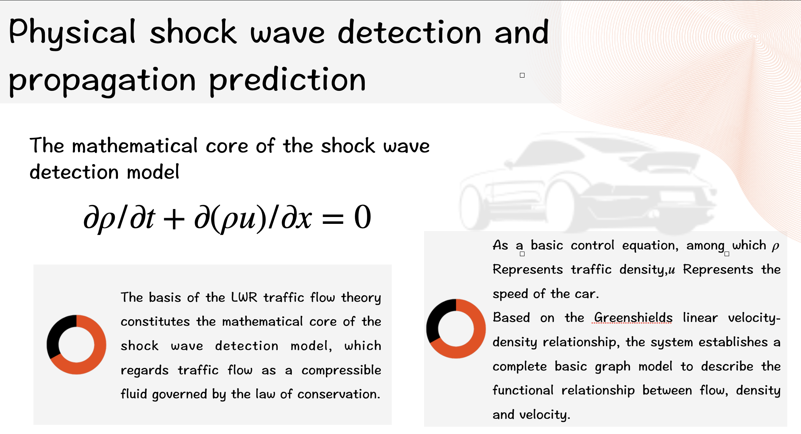

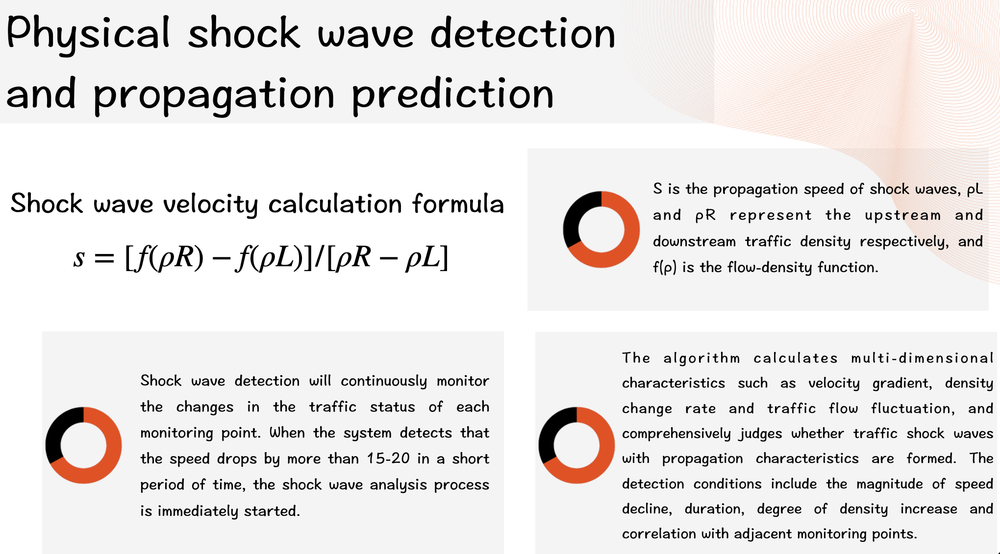

</td>
</tr>
</table>

---

## 資料來源與處理

<table>
<tr>
<td width="50%">

### 資料來源

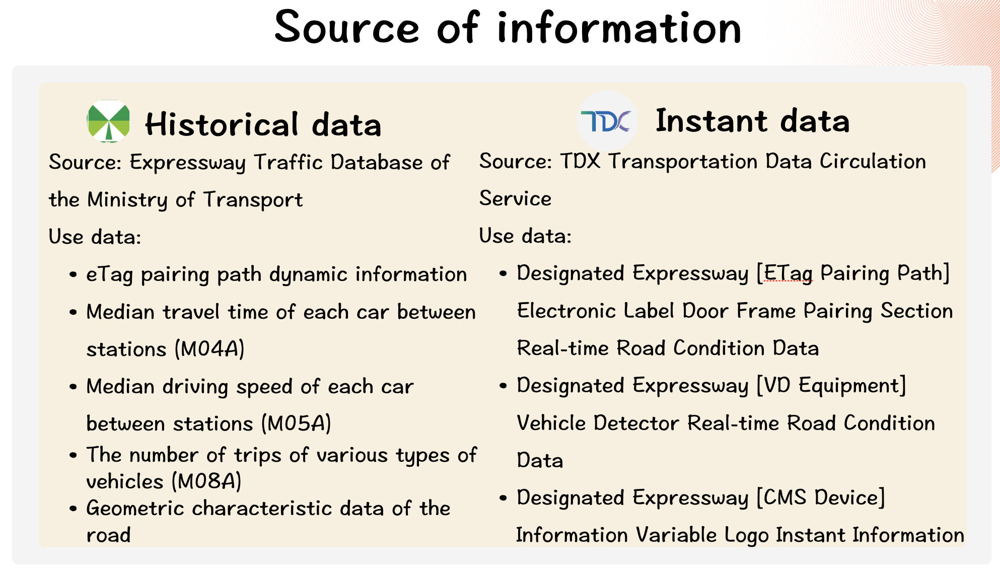

**歷史資料**來自 TISC（台灣高速公路交通資料庫）：
- eTag 配對路徑動態資訊
- 站間各車種中位數旅行時間 (M04A)
- 站間各車種中位數行駛車速 (M05A)
- 各類車種旅次數量 (M08A)

**即時資料**來自 TDX 平台：
- 電子標籤門架配對路段即時路況
- VD 設備車輛偵測器即時路況
- CMS 設備資訊可變標誌即時資訊

</td>
<td width="50%">

### 資料品質控管

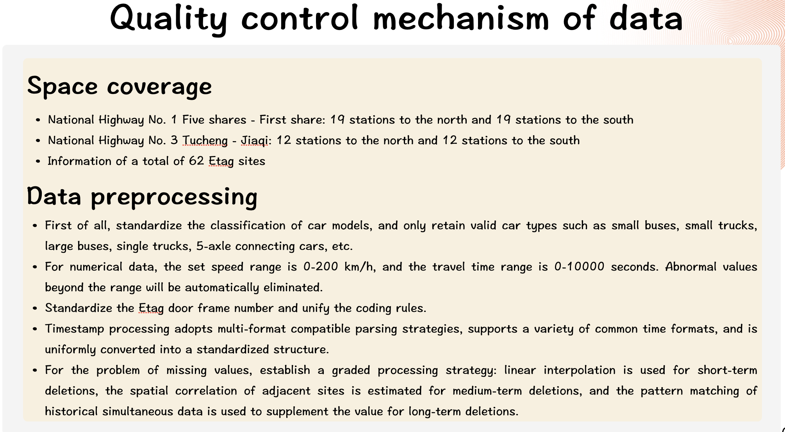

### 車種小客車當量標準化

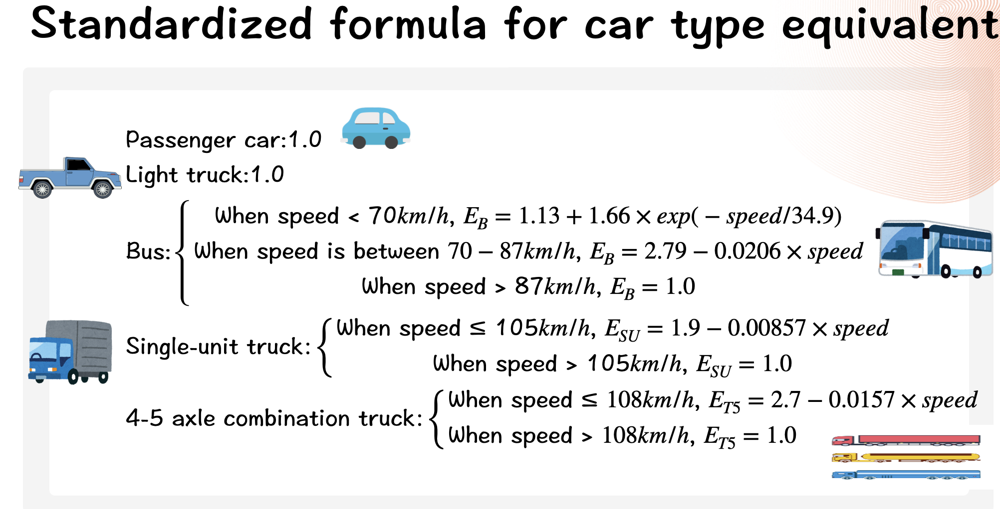

</td>
</tr>
</table>

---

## 快速開始

### 環境需求

- Python 3.11+
- Node.js 18.0+
- TDX API 憑證（[申請網址](https://tdx.transportdata.tw/)）
- Google Maps API 金鑰（[取得網址](https://console.cloud.google.com/)）

### 安裝步驟

```bash
# 複製儲存庫
git clone https://github.com/timwei0801/Highway_trafficwave.git
cd Highway_trafficwave

# 後端設定
python -m venv venv
source venv/bin/activate  # Windows: venv\Scripts\activate
pip install -r requirements.txt

# 前端設定
cd frontend && npm install && cd ..

# 配置環境變數
cp .env.example .env
# 編輯 .env 填入你的 API 憑證
```

### 啟動服務

```bash
# 方式一：一鍵部署
./deploy.sh

# 方式二：手動啟動
# 終端機 1 - 後端
cd api && python main.py

# 終端機 2 - 前端
cd frontend && npm run dev
```

### 訪問端點

| 介面 | URL | 說明 |
|:-----|:----|:-----|
| 🚗 駕駛者儀表板 | http://localhost:3000/driver | 導航與警報 |
| 🎛️ 管理者控制中心 | http://localhost:3000/admin | 系統管理 |
| 📚 API 文件 | http://localhost:8000/docs | Swagger UI |

---

## API 使用範例

<details>
<summary><b>取得活躍衝擊波</b></summary>

```python
import requests

response = requests.get('http://localhost:8000/api/shockwave/active')
shockwaves = response.json()

for sw in shockwaves['active_shockwaves']:
    print(f"嚴重度: {sw['severity']}, 速度下降: {sw['speed_drop']} km/h")
```

</details>

<details>
<summary><b>交通預測</b></summary>

```python
payload = {
    "station_ids": ["01F0340N", "01F0360N"],
    "prediction_steps": 12  # 60 分鐘
}

response = requests.post('http://localhost:8000/api/prediction/traffic', json=payload)
predictions = response.json()
```

</details>

<details>
<summary><b>AI 助理查詢</b></summary>

```python
payload = {
    "query": "從台北到新竹最佳出發時間？",
    "context": {"origin": "台北", "destination": "新竹"}
}

response = requests.post('http://localhost:8000/api/rag/chat', json=payload)
print(response.json()['response'])
```

</details>

---

## 系統性能

<table>
<tr>
<td width="33%" align="center">
<h3>87%</h3>
<sub>衝擊波檢測準確率</sub>
</td>
<td width="33%" align="center">
<h3>&lt;5 秒</h3>
<sub>檢測延遲</sub>
</td>
<td width="33%" align="center">
<h3>90%</h3>
<sub>預測信心度</sub>
</td>
</tr>
</table>

---

## 資料來源

<table>
<tr>
<td width="50%">

### 歷史資料

**來源**：交通部高速公路交通資料庫

- eTag 配對路徑動態資訊
- 站間各車種中位數旅行時間 (M04A)
- 站間各車種中位數行駛車速 (M05A)
- 各類車種旅次數量 (M08A)
- 道路幾何特性資料

</td>
<td width="50%">

### 即時資料

**來源**：TDX 運輸資料流通服務

- 電子標籤門架配對路段即時路況
- VD 設備車輛偵測器即時路況
- CMS 設備資訊可變標誌即時資訊

</td>
</tr>
</table>

---

## 論文引用

```bibtex
@article{zou2024mtstnet,
  title={MT-STNet: A Novel Multi Task Spatiotemporal Network for Highway Traffic Flow Prediction},
  author={Zou, Guojian and others},
  journal={IEEE Transactions on Intelligent Transportation Systems},
  year={2024},
  doi={10.1109/TITS.2024.3411638}
}

@software{highway_shockwave_system,
  title={高速公路智慧交通衝擊波預警決策支援系統},
  author={Wei, Tim},
  year={2024},
  url={https://github.com/timwei0801/Highway_trafficwave}
}
```

> **備註**：MT-SWNet 是本團隊基於原版 MT-STNet 架構的改良版本。

---

## 授權協議

本專案採用 MIT 授權協議 - 詳見 [LICENSE](LICENSE) 檔案。

---

## 致謝

- **MT-STNet 研究團隊** - 原版深度學習模型架構
- **台灣交通部** - TDX 開放資料平台
- **TensorFlow、FastAPI、Next.js** - 開源框架

---

<p align="center">
  <a href="https://github.com/timwei0801/Highway_trafficwave">
    
  </a>
  <a href="https://github.com/timwei0801/Highway_trafficwave/fork">
    
  </a>
</p>

<p align="center">
  <sub>基於尖端科學研究的 AI 驅動出行安全</sub>
</p>
